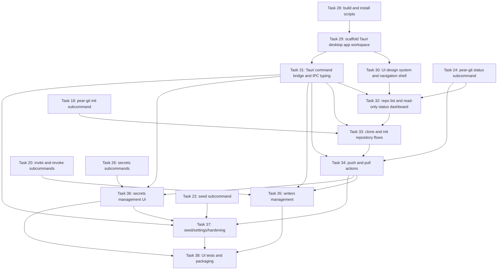

# Task Overview — gittorrent

> Generated from architecture/ on 2026-04-25.

| ID | Title | Agent | Depends On | Status |
|----|-------|-------|------------|--------|
| 01 | Project scaffolding, package.json, test runner | backend-dev | — | [x] |
| 02 | Tests for codec.js | tdd-test-writer | 01 | [x] |
| 03 | codec.js — compact-encoding schemas for all 6 op types | backend-dev | 02 | [x] |
| 04 | Tests for identity.js | tdd-test-writer | 01 | [x] |
| 05 | identity.js — ed25519 keypair load/create/sign/verify | backend-dev | 04 | [x] |
| 06 | Tests for object-store.js | tdd-test-writer | 01 | [x] |
| 07 | object-store.js — Hyperbee content-addressed git object store | backend-dev | 06 | [x] |
| 08 | Tests for secrets.js | tdd-test-writer | 04 | [x] |
| 09 | secrets.js — X25519 derivation, seal/open, encrypt/decrypt | backend-dev | 08, 05 | [x] |
| 10 | Tests for autobase-repo.js | tdd-test-writer | 03, 05 | [x] |
| 11 | autobase-repo.js — Autobase wrapper and deterministic apply() | backend-dev | 10, 07, 09 | [x] |
| 12 | Tests for swarm.js | tdd-test-writer | 01 | [x] |
| 13 | swarm.js — Hyperswarm peer lifecycle and Corestore replication | backend-dev | 12, 11 | [x] |
| 14 | Tests for remote-helper.js | tdd-test-writer | 03 | [x] |
| 15 | remote-helper.js — stdin/stdout git remote helper protocol | backend-dev | 14, 11, 13 | [x] |
| 16 | bin/git-remote-pear — entry point | backend-dev | 15 | [x] |
| 17 | Tests for pear-git init | tdd-test-writer | 11 | [x] |
| 18 | pear-git init subcommand | backend-dev | 17, 13 | [x] |
| 19 | Tests for pear-git invite and revoke | tdd-test-writer | 11 | [x] |
| 20 | pear-git invite and revoke subcommands | backend-dev | 19, 18, 09 | [x] |
| 21 | Tests for pear-git seed | tdd-test-writer | 13 | [x] |
| 22 | pear-git seed subcommand | backend-dev | 21, 18 | [x] |
| 23 | Tests for pear-git status | tdd-test-writer | 11 | [x] |
| 24 | pear-git status subcommand | backend-dev | 23, 18 | [x] |
| 25 | Tests for pear-git secrets subcommands | tdd-test-writer | 09, 11 | [ ] |
| 26 | pear-git secrets add, get, list, rm, rotate | backend-dev | 25, 20 | [ ] |
| 27 | e2e test: clone-push-pull with two in-process peers | tdd-test-writer | 16, 26 | [ ] |
| 28 | build and install scripts | backend-dev | 16, 26 | [ ] |
| 29 | scaffold Tauri desktop app workspace | frontend-dev | 28 | [ ] |
| 30 | UI design system and navigation shell | frontend-dev | 29 | [ ] |
| 31 | Tauri command bridge and IPC typing | fullstack-dev | 29 | [ ] |
| 32 | repository list and read-only status dashboard | frontend-dev | 30, 31, 24 | [ ] |
| 33 | clone and init repository flows | fullstack-dev | 31, 32, 18 | [ ] |
| 34 | push and pull actions with sync feedback | fullstack-dev | 31, 33, 24 | [ ] |
| 35 | writers management (invite and revoke) | fullstack-dev | 31, 34, 20 | [ ] |
| 36 | secrets management UI flows | fullstack-dev | 31, 34, 26 | [ ] |
| 37 | seeding controls, settings, and hardening | fullstack-dev | 31, 34, 36, 22 | [ ] |
| 38 | UI tests, packaging, and release readiness | qa-release-dev | 35, 36, 37 | [ ] |

## UI Task Dependency Graph

